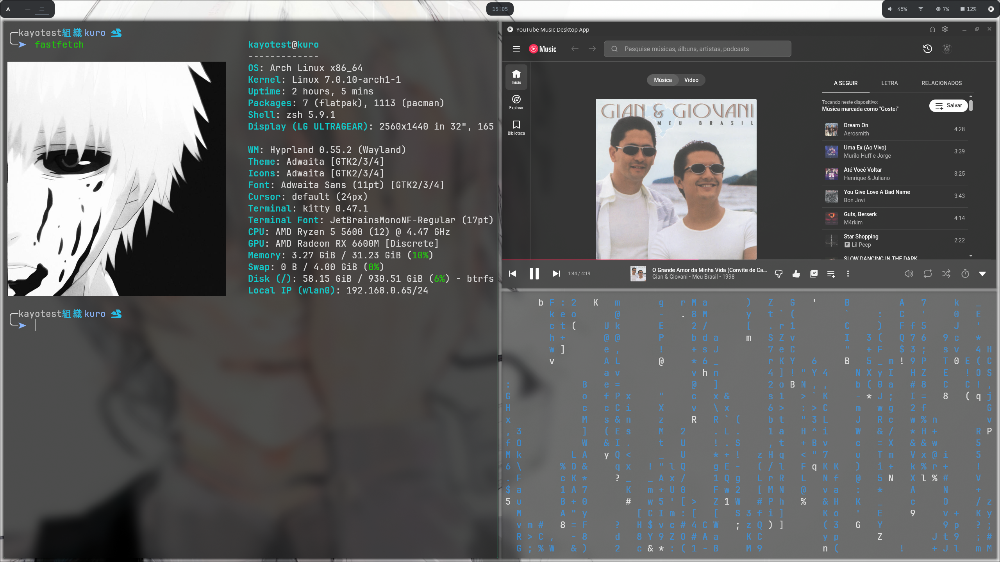

# Kuro Rice

Meu setup pessoal para Arch Linux usando Hyprland.

## Componentes

* Hyprland
* Waybar
* Wofi
* Foot
* Zsh

## Estrutura

```text
foot/
hypr/
scripts/
themes/
waybar/
wofi/
zsh/
```

## Screenshots

()

## Wallpapers

Os wallpapers não estão incluídos no repositório para reduzir seu tamanho.

## Instalação

Clone o repositório:

```bash
git clone https://github.com/Kayo-HS/ArchLinux
```

Copie os arquivos para sua pasta `.config`:

```bash
cp -r hypr ~/.config/
cp -r waybar ~/.config/
cp -r wofi ~/.config/
cp -r foot ~/.config/
```

## Licença

Uso pessoal e educacional.
